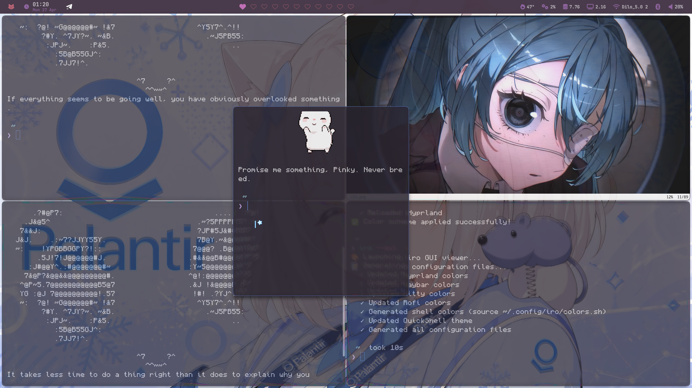

# Hyprland Liquid Glass

LiquidGlass is a Hyprland plugin that renders a per-window liquid glass material. It samples the framebuffer behind each window, applies a small Gaussian frost blur, then adds Hyprland-rounded body lensing, edge refraction, subtle color dispersion, adaptive tinting, grain, shadow, and specular highlights.

The effect is rendered as a window decoration under normal client surfaces and as a render-pass element under selected layer-shell surfaces. The plugin also lowers managed window alpha slightly so normal opaque apps can show the material without requiring app-specific transparency.



## Requirements

- Hyprland with plugin support
- Hyprland headers matching the running compositor
- `pkg-config`
- C++23 compiler
- `make`

Hyprland plugins are ABI-sensitive. Rebuild this plugin whenever Hyprland updates.

## Install With Hyprpm

```bash
hyprpm add https://github.com/0xdilo/hyprland-liquid-glass
hyprpm enable liquidglass
hyprpm reload
```

## Manual Build

```bash
make
hyprctl plugin load "$PWD/liquidglass.so"
```

For a persistent manual load, add the built plugin path to `hyprland.conf`:

```ini
plugin = /absolute/path/to/liquidglass.so
```

## Config

All options live under `plugin:liquidglass:` in `hyprland.conf`.

```ini
plugin:liquidglass {
    enabled = 1

    # Optional. No applications are excluded by default.
    # Use this for media players, browsers, or apps that should stay fully opaque.
    exclude_classes = mpv,helium
    layer_namespaces = quickshell

    window_opacity = 0.90
    layer_opacity = 1.0
    layer_corner_radius = 12
    glass_opacity = 0.78

    blur_strength = 0.32
    blur_iterations = 2

    refraction_strength = 1.15
    chromatic_aberration = 0.55
    lens_distortion = 1.15

    fresnel_strength = 0.46
    specular_strength = 0.38
    edge_thickness = 0.040

    # RRGGBBAA
    tint_color = 0xb8d8ff00

    brightness = 0.88
    contrast = 1.16
    saturation = 1.14
    vibrancy = 0.32
    adaptive_dim = 0.32
    adaptive_boost = 0.10
}
```

For a stronger, more visible setup, use the checked-in [evident preset](presets/evident.conf). It keeps the stable compositor path and makes the material easier to see with thicker refractive edges, stronger lensing, brighter specular highlights, and slightly more managed-window transparency.

## Layer Shell Surfaces

Layer-shell clients such as Quickshell bars, launchers, notifications, and panels are not normal windows, so LiquidGlass renders them through a separate layer pass. Only namespaces listed in `layer_namespaces` receive the material. The default is `quickshell`.

Fullscreen layer-shell overlays are skipped by the plugin pass. Many launchers use one transparent fullscreen layer and draw the visible panel inside it; rendering a compositor-sized LiquidGlass rectangle behind that layer causes flashes or glass in empty screen areas. Keep Hyprland layer blur enabled for those overlays and make the actual QML panel background translucent.

Keep the layer's own background transparent enough for the backing material to show. You can keep the layer rules below; LiquidGlass disables Hyprland's layer blur only for matched non-fullscreen layers that receive its sampled blur:

```ini
layerrule = match:namespace quickshell, blur on
layerrule = match:namespace quickshell, blur_popups on
layerrule = match:namespace quickshell, ignore_alpha 0.08
layerrule = match:namespace quickshell, xray 0
```

Set the panel background alpha low enough for the compositor material to show through. For example, the current Quickshell setup uses panel alpha around `0.62` for primary surfaces and `0.52` for softer surfaces. Keep `xray` off if you want the sampled material to use other windows behind the layer instead of mostly wallpaper.

### Options

| Option | Default | Notes |
| --- | ---: | --- |
| `enabled` | `1` | Enables or disables the plugin effect. |
| `exclude_classes` | empty | Comma-separated window classes to leave untouched. Matching is case-insensitive and checks current and initial class. |
| `layer_namespaces` | `quickshell` | Comma-separated layer-shell namespaces that should receive the material. Matching is case-insensitive. |
| `window_opacity` | `0.90` | Alpha applied to managed window surfaces so the glass backing can show through. Set to `1.0` to avoid forcing opacity. |
| `layer_opacity` | `1.0` | Alpha applied to matched layer-shell surfaces. Lower this only if a layer is fully opaque and you want the backing material to show through. |
| `layer_corner_radius` | `12` | Corner radius used for matched layer-shell glass rectangles, in layout pixels. |
| `glass_opacity` | `0.78` | Strength of the rendered glass backing. |
| `blur_strength` | `0.32` | Radius multiplier for the sampled background blur. |
| `blur_iterations` | `2` | Number of horizontal/vertical blur passes. Higher values cost more GPU time. |
| `refraction_strength` | `1.15` | Edge refraction amount. |
| `chromatic_aberration` | `0.55` | Color channel separation near refractive edges. |
| `lens_distortion` | `1.15` | Center lens distortion amount. |
| `fresnel_strength` | `0.46` | Edge glow strength. |
| `specular_strength` | `0.38` | Diagonal highlight strength. |
| `edge_thickness` | `0.040` | Width of the refractive edge band relative to the window size. |
| `tint_color` | `0xb8d8ff00` | Glass tint as `RRGGBBAA`. Alpha `00` disables tint. |
| `brightness` | `0.88` | Brightness applied to sampled glass. |
| `contrast` | `1.16` | Contrast applied to sampled glass. |
| `saturation` | `1.14` | Saturation applied to sampled glass. |
| `vibrancy` | `0.32` | Extra saturation for already colorful sampled content. |
| `adaptive_dim` | `0.32` | Dims bright sampled content to keep text readable. |
| `adaptive_boost` | `0.10` | Brightens dark sampled content. |

## Performance Notes

LiquidGlass renders only around windows that use the material. It samples a padded region behind each affected window, blurs that sample in an offscreen framebuffer, and composites the final glass pass back into the current render pass.

For lower GPU cost, reduce `blur_iterations`, `blur_strength`, or `glass_opacity`. For a subtler effect on opaque apps, increase `window_opacity`.

## Development

```bash
make clean
make
hyprctl plugin unload "$PWD/liquidglass.so"
hyprctl plugin load "$PWD/liquidglass.so"
```

Check Hyprland config errors after changing options:

```bash
hyprctl configerrors
```

## License

MIT
